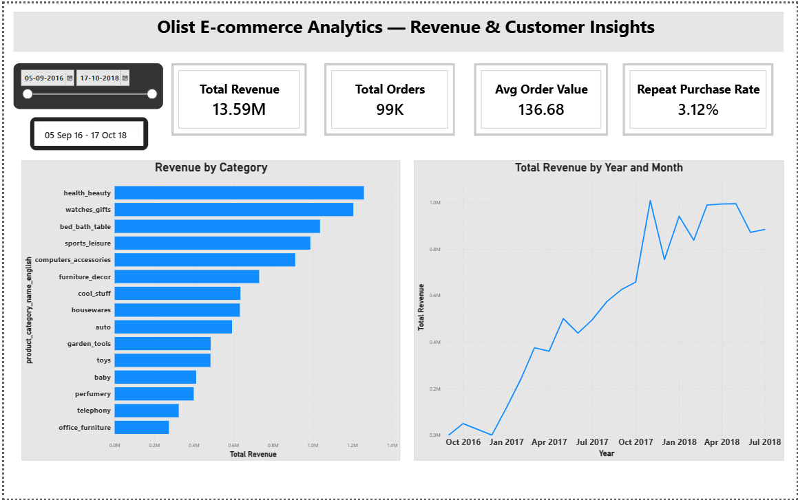
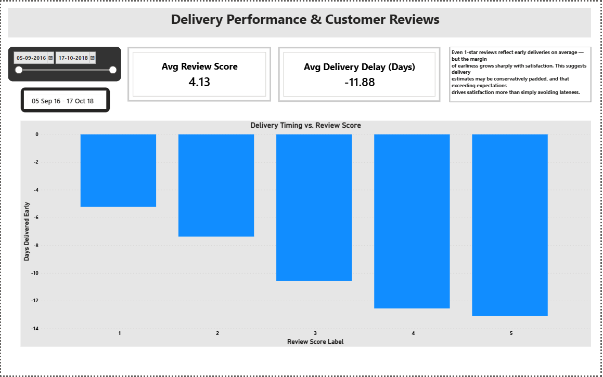

E-commerce Analytics: SQL + Power BI

An end-to-end analytics project on the Olist Brazilian e-commerce dataset — 9 raw tables, ~100,000 orders — covering database design, advanced SQL, and a two-page Power BI dashboard.

Dashboard file: [`powerbi/ecommerce_analytics.pbix`](powerbi/ecommerce_analytics.pbix) (open in [Power BI Desktop](https://powerbi.microsoft.com/desktop/), free)
Static views: [PDF export](docs/ecommerce_analytics.pdf) · screenshots below

---

Tech stack

-Database: PostgreSQL, hosted on Supabase
-SQL: joins, CTEs, window functions, data quality auditing
-Visualization: Power BI Desktop (data model, DAX measures, dashboards)
-Version control: Git / GitHub

---

Dataset

[Olist Brazilian E-commerce dataset](https://www.kaggle.com/datasets/olistbr/brazilian-ecommerce) — 9 CSVs covering orders, order items, customers, products, sellers, payments, reviews, geolocation, and category name translations. Loaded raw into PostgreSQL with no pre-cleaning, so the cleaning and validation work is visible in SQL rather than done invisibly beforehand.

---

Database design

Primary keys were set per table, including composite keys where a single column wasn't unique:

| Table | Primary Key |
|---|---|
| orders | order_id |
| order_items | order_id + order_item_id (composite — an order can have multiple items) |
| payments | order_id + payment_sequential (composite — some orders had split payments) |
| category_translation | product_category_name (no numeric ID existed; the name itself is the natural key) |
| customers, products, sellers, reviews | single-column PKs |

Foreign keys link `order_items`, `payments`, and `reviews` back to `orders`, and `products` to `category_translation`.

---

Data quality audit

All 9 tables were checked for nulls, duplicates, and orphaned foreign keys (full queries in [`sql/01_data_quality_audit.sql`](sql/01_data_quality_audit.sql)). Key findings:

-`orders`: nulls in `order_approved_at`, `order_delivered_carrier_date`, and `order_delivered_customer_date` were fully explained by order status (non-delivered orders naturally lack delivery timestamps) — confirmed by cross-checking against the order_status breakdown, not just assumed.
-`products`: 610 rows had no category assigned; left as NULL and handled with `COALESCE(...'uncategorized')` in reporting rather than fabricating a category.
-`sellers`: only 23 of 27 possible Brazilian states appear — a real business pattern (seller distribution), not a data defect.

Foreign key issue found and fixed ([`sql/02_fk_fixes.sql`](sql/02_fk_fixes.sql)): adding the FK from `products` to `category_translation` failed because two category values — `pc_gamer` and `portateis_cozinha_e_preparadores_de_alimentos` — existed in `products` but had no matching row in the translation table. Diagnosed with a `LEFT JOIN` + `NULL` check, fixed by inserting the two missing rows, then the constraint applied cleanly.

customer_id vs. customer_unique_id: an early repeat-purchase query returned 100% one-time buyers, which didn't make sense for an e-commerce platform. Investigation showed `orders.customer_id` is generated per order, not per person — the real customer identifier is `customers.customer_unique_id`. Correcting the join and re-running the analysis (and the cohort and window-function queries, which had the same issue) gave a realistic result.

---

Business questions & findings

1. What share of customers are repeat buyers?
[`sql/06_repeat_buyer_analysis.sql`](sql/06_repeat_buyer_analysis.sql)

3.12% of customers made repeat purchases; 96.88% were one-time buyers. Low, but consistent with this dataset's known characteristics and limited transaction window.

2. Does delivery timing relate to review scores?
[`sql/07_delivery_delay_vs_reviews.sql`](sql/07_delivery_delay_vs_reviews.sql)

| Review Score | Avg. Days Delivered Early |
|---|---|
| 1 star | 4.58 |
| 2 stars | 6.54 |
| 3 stars | 9.66 |
| 4 stars | 11.59 |
| 5 stars | 12.14 |

Every review score reflects early deliveries on average — none are late. But themargin of earliness rises sharply with satisfaction: 5-star orders arrived nearly 12.5 days ahead of estimate, versus 4.6 days for 1-star orders. This suggests delivery estimates may be conservatively padded, and that exceeding expectations — not just avoiding lateness — is what drives satisfaction.

3. Which categories and sellers perform best?
[`sql/08_category_revenue.sql`](sql/08_category_revenue.sql)

Health & beauty led total revenue (~R$1.26M), butwatches & gifts stood out for average order value — generating nearly as much revenue with about 35% fewer orders.

---

Dashboard

Page 1 — Revenue Insights
KPI summary (total revenue, orders, AOV, repeat purchase rate), revenue by category, and revenue trend over time with a dynamic date-range filter.



Page 2 — Delivery & Reviews
Average delivery-vs-estimate margin broken down by review score, visualizing finding 2 above.



---

Repository structure

```
sql/
├── 01_data_quality_audit.sql
├── 02_fk_fixes.sql
├── 03_main_join.sql
├── 04_cohort_cte.sql
├── 05_window_function.sql
├── 06_repeat_buyer_analysis.sql
├── 07_delivery_delay_vs_reviews.sql
└── 08_category_revenue.sql
powerbi/
└── ecommerce_analytics.pbix
docs/
├── revenue_insights.png
├── delivery_reviews.png
└── ecommerce_analytics.pdf
```

How to explore this project

-SQL: open any file in `sql/` — each is commented with what it checks or answers
-Dashboard: download `powerbi/ecommerce_analytics.pbix` and open in Power BI Desktop (free), or view the static screenshots/PDF in `docs/`
